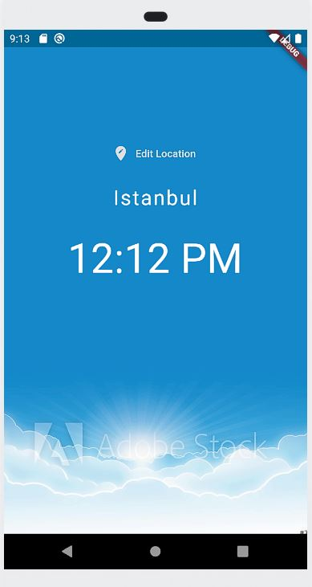
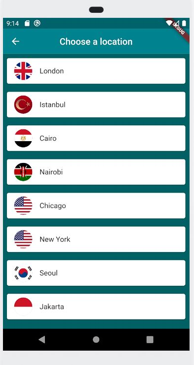

# WorldTimes

Shows specific world's country's central cities hours.

Dünyanın belirli ülkelerinin başkentlerinin saatlerini gösterir.

  

If it is day time background photo is going to be light, if it is night time background photo is going to be dark. If you click edit location button you can choose other cities from the screen.

Gündüz ise arka plan fotoğrafı açık, gece ise arka plan fotoğrafı karanlık olacak. Konumu düzenle düğmesine tıklarsanız, ekrandan diğer şehirleri seçebilirsiniz.

  

